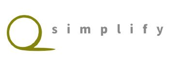

<p align="center">
    <br>
    
    <br>
<p>

# Simplify (In Maintenance)

Everything you need for text simplification, reconstruct phrasal texture, rephrase and increase readability.


These are techniques for simplifiying sentences:

- [X] [Discourse](https://github.com/Lambda-3/DiscourseSimplification)
- [X] [OpenIE6](https://github.com/dair-iitd/openie6)
- [ ] [BiSECT](https://github.com/mounicam/BiSECT) 
- [ ] [Lexical simplification](https://github.com/mounicam/lexical_simplification) 
- [ ] [Controllable Simplification](https://github.com/mounicam/controllable_simplification)
- [ ] [Neural Text Simplification](https://github.com/senisioi/NeuralTextSimplification) 


## Evaluators

Metrics to measure the performance of sentence simplifications:

1. Sari
2. Bleu

## Install

```shell
git clone https://github.com/sadakmed/simplify.git
cd simplify/
pip install -r requirements.txt
pip install  .
```
## Use

```python
from simplify.simplifiers import DiscourseSimplification
discourse = DiscourseSimplification()
simple_output = discourse(complex_sentence_list)
```

# Citations
```
@InProceedings{cetto2018graphene,
	  author    = {Matthias Cetto and Christina Niklaus and Andr\'{e} Freitas and Siegfried Handschuh},
	  title     = {Graphene: Semantically-Linked Propositions in Open Information Extraction},
	  booktitle = {Proceedings of the 27th International Conference on Computational Linguistics},
	  year      = {2018},
	  publisher = {Association for Computational Linguistics},
  	  pages     = {2300--2311},
	  location  = {Santa Fe, New Mexico, USA},
 	  url 	    = {http://aclweb.org/anthology/C18-1195}
	} 

@inproceedings{kolluru&al20,
    title = "{O}pen{IE}6: {I}terative {G}rid {L}abeling and {C}oordination {A}nalysis for {O}pen {I}nformation {E}xtraction",\
    author = "Kolluru, Keshav  and
      Adlakha, Vaibhav and
      Aggarwal, Samarth and
      Mausam, and
      Chakrabarti, Soumen",
    booktitle = "The 58th Annual Meeting of the Association for Computational Linguistics (ACL)",
    month = July,
    year = "2020",
    address = {Seattle, U.S.A}
}

```
